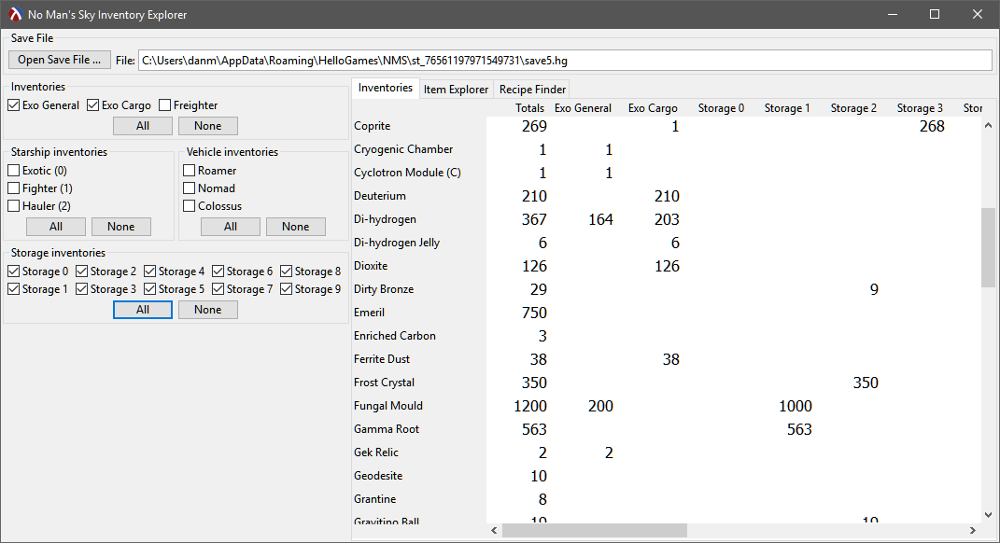
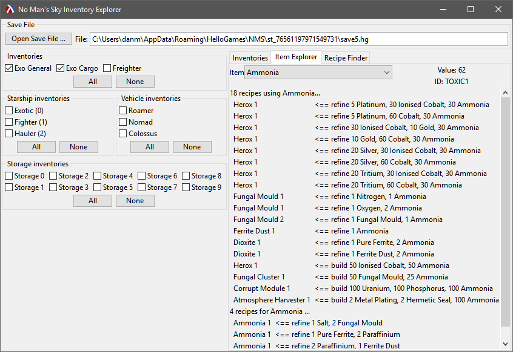
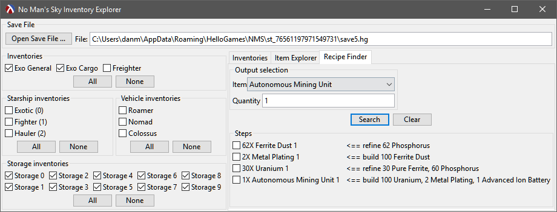

# NMS Inventory Explorer

This is an unfinished utility for flexibly viewing character
inventories in No Man's Sky, and exploring crafting possibilities in
relation to the current state of these inventories. It reads your
inventories from the game save file, and thus reflects their state as
of your last save. It never attempts to modify your game save file.

I had the idea for this utility while playing the game when I got
frustrated sorting through my inventory in the game No Man's Sky, and
figuring what chain of crafting recipes I could apply to create a
particular product.

This project is a work in progress. Usable alpha-quality
[releases] are available. Download the zip file, unpack the directory tree
it contains to a convenient location, and run the executable file in the 
tree.

## Using the Software

The inventory selection checkboxes determine which of your inventories
are displayed and used when searching for recipes.

The Inventories tab shows a tabular summary of the selected inventories,
starting with a Totals column. There's one row for every item that
is represented in the selected inventories. In other words, no row
is show for an item unless you have at least one of that item in a
selected inventory.

The Item Explorer tab shows you some basic information about an item,
including lists of recipes that use that item as an input, or that
produce it as an output.

The Recipe Finder tab helps you find recipes for items that you wish
to craft. Choose a craftable item from the choice box, enter how many
of the item you want, and press the Search button. The program will
try to find the "best" sequence of crafting steps for fulfilling that
request, based on your currently selected inventories. If the item 
can't be built from your selected inventories, it will still suggest
a recipe chain and tell you what you're missing.

The choice of "best" recipe sequence is based on a simplistic cost calculation
that currently looks at the length of the recipe sequence, and the total number
of items still missing to use it (which will be zero if the sequence can
actually be satisfied by selected inventories).

Future releases may tweak this cost calculation, and/or may show multiple
chains for you to choose from.

The checkboxes next to crafting steps do nothing; they're provided just to
help you keep track while applying a lengthy sequence.

Startup state, showing table of selected inventory contents:

Item exploration:

Recipe finder after successfully finding a recipe chain using selected inventory:

## Implementation Notes

The software is written in [Racket], and uses its native GUI library.
To run the software yourself, download and install the DrRacket IDE,
open the NMSInventoryExplorer.rkt file, and press F5 or click the Run
button.

The IDE and its debugging tools are capable but not wonderful. However,
you can get programming with it very quickly, and the documentation
for the language and its libraries is quite good.

## Building

To build a release, simply open the NMSInventoryExplorer.rkt file with
DrRacket, and choose menu item "Racket", then "Create
Executable...". In the dialog, select "Distribution" as the "Type",
and "GRacket" as the "Base".  Make sure to check "Embed DLLs in the
executable?"  Click "Create" and wait. You'll end up with a zip file
containing the executable and supporting subdirectories. Total
unpacked size is on the order of 45MB.

## Testing

The software currently locates your most recent game save file and
reads that. Thus it assumes that you have a game save file from a
recent version of the game.

## Possible future enhancements
* Offer multiple recipe chain results after a search.
* Allow selection of save file (and maybe include a test file in the project).
* Support older save file versions (e.g. without obfuscated JSON tags).

[Racket]: https://racket-lang.org/
[releases]: https://github.com/dwmuller/NMSInventoryExplorer/releases
